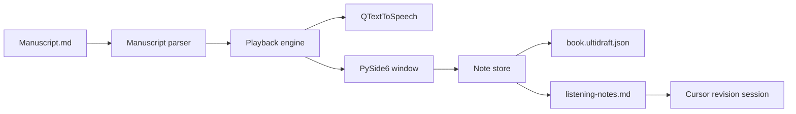

# Ultidraft

Listen to a manuscript draft on your PC, pause on the sentence that snags, leave a note, and export those notes for Cursor.

Ultidraft is a writer tool in the same family as Ultifile and Ultiplay. There is no account and no AI in the listen/note loop. Playback can use voices installed on this PC, or free Microsoft neural voices (the same family Edge uses) in continuous reading spans.

I use it to revise a novel-in-progress by ear. The manuscript stays on disk; Ultidraft never uploads it.

## Why it exists

Silent rereading skips clunky rhythm and repeated words. Existing listen-aloud apps are good at playback and weak at handing notes back to a revision workflow. Ultidraft's product is the export: each note carries the quoted sentence so an editor (or Cursor) can find the spot after the draft has changed.

## Desktop v1

- Open a `.md` manuscript
- Chapter list, sentence highlight, play / pause / skip
- Flip to **Edit** at the current sentence (`E`), change the manuscript, then **Listen** (`Esc`) to keep going
- Add a typed note on the current sentence (`N`); double-click a note to edit it
- Save notes beside the book as `*.ultidraft.json`
- Export `listening-notes.md` for Cursor (`Ctrl+E`)
- Restore last file, sentence, speed, and voice on launch
- Voice menu: neural narrators (internet) or the voices already on this PC
- Speak a note into the microphone (Windows speech recognition; first use turns on Speech in Windows Settings)
- Per-book pronunciation rules (Voice → Pronunciation rules), e.g. Sk4ms → scams

Android is planned as a second client against the same sidecar schema, not a rewrite of the parser.

## Architecture

Qt stays in the window and the speech engine. The domain layer is plain Python so a future mobile app can read and write the same files.



| Layer | Package | Qt? |
|---|---|---|
| Parse chapters and sentences | `ultidraft.domain.manuscript` | No |
| Notes sidecar | `ultidraft.domain.notes` | No |
| Cursor export | `ultidraft.domain.export` | No |
| Last session | `ultidraft.persist.session` | No |
| Windows voices | `ultidraft.tts.engine` | Yes |
| Window | `ultidraft.ui` | Yes |

## Note format

Sidecar next to the manuscript, e.g. `SODOM.ultidraft.json`:

```json
{
  "version": 1,
  "manuscript_path": "SODOM.md",
  "manuscript_hash": "<sha256>",
  "position": { "chapter_id": "ch-07", "sentence_index": 184 },
  "notes": [
    {
      "id": "N014",
      "created": "2026-08-14T20:00:00-06:00",
      "chapter_title": "Chapter 7: The Desert",
      "anchor_quote": "The angel did not look back.",
      "context_before": "...",
      "context_after": "...",
      "sentence_index": 184,
      "body": "This beat is rushed. Give Lot one more line of hesitation."
    }
  ]
}
```

Export (`listening-notes.md`) is what you feed Cursor:

```markdown
# Ultidraft notes — 2026-08-14
Manuscript: SODOM.md
Hash: <sha256>

## N014
- Chapter: 7: The Desert
- Anchor quote: "The angel did not look back."
- Context: "...previous... [HERE] ...next..."
- Note: This beat is rushed. Give Lot one more line of hesitation.
```

Anchors are quotes, not page numbers. If the chapter is rewritten, Cursor can still fuzzy-find the sentence. The hash tells you the notes were taken against an older draft.

## Run

### Desktop app

After a build, launch **Ultidraft** from the Desktop shortcut, or:

```
C:\Users\march\Desktop\Ultidraft\dist\Ultidraft\Ultidraft.exe
```

Rebuild the `.exe` and refresh the shortcut:

```powershell
cd C:\Users\march\Desktop\Ultidraft
python scripts/build_exe.py
```

### From source

Python 3.12+ on Windows.

```powershell
cd C:\Users\march\Desktop\Ultidraft
python -m venv .venv
.\.venv\Scripts\Activate.ps1
python -m pip install -e ".[dev]"
python -m ultidraft
```

Open your draft with **File → Open** (`Ctrl+O`). Keyboard:

| Key | Action |
|---|---|
| Space | Play / pause |
| Left / Right | Previous / next sentence |
| E | Edit the manuscript at this sentence |
| Esc | Return to listening (saves if you changed the text) |
| N | Add note on this sentence |
| Ctrl+S | Save manuscript (while editing) |
| Ctrl+E | Export `listening-notes.md` |
| Ctrl+O | Open manuscript |

Then in Cursor: open the manuscript and `listening-notes.md`, and ask it to apply each note using the anchor quote as the location.

## Voices

This PC's built-in SAPI voices (David, Zira, Mark) are robotic. Ultidraft defaults to **Jenny**, a free Microsoft neural voice, and lets you switch from the Voice menu or the transport bar.

- **Neural (internet):** Jenny, Aria, Guy, Christopher, and a few British/Australian narrators. A few minutes of consecutive chapter text is narrated as one continuous span. No account and no Cursor tokens.
- **This PC:** stays fully offline. Use these if you are off-network or do not want sentences leaving the machine.

The first neural span can take a second to fetch. After that, Ultidraft caches audio and preloads the next span in a standby player, removing the media-loading pause between lines.

### Keeping the narrator moving

Listening for an hour means playback cannot stall, so `SpeechEngine` follows three rules:

- **Cache files are written through a staging file and renamed into place.** A clip only appears at its real path once it is complete, so the player can never open a half-downloaded MP3. This was the actual cause of the narrator getting stuck mid-chapter.
- **Every utterance carries a generation token, and all recovery paths funnel into one `_advance`.** End of clip, decode error, a stall, or a fetch timeout each ask to move on, and the token makes that happen exactly once. No skipped lines, no repeats.
- **Each clip gets a fresh player.** Reusing one `QMediaPlayer` let stale events from the finished clip strand the next one.
- **The next fresh player is loaded in standby.** When a span finishes, the ready player is promoted immediately instead of loading the next file in the audible gap.

A failed fetch retries once, then skips that line. Three failures in a row means the network is gone, so it falls back to an offline voice instead of dropping the line silently.

## Tests

```powershell
python -m pytest
```

Coverage is the non-UI contract: Sodom-style chapter headings, dialogue sentence splits, sidecar round-trip, export markdown, and the playback recovery rules above.

Two scripts check real audio, which unit tests cannot:

```powershell
python scripts/smoke_playback.py   # plays 8 spans, one clip deliberately corrupted
python scripts/smoke_window.py     # drives the real window through SODOM.md with pause/resume
```

Both report dead air between clips and the longest time spent on one sentence.

## Build

```powershell
python -m pip install -e ".[build]"
python scripts/make_icon.py
python scripts/build_exe.py
```

PyInstaller writes an app folder at `dist/Ultidraft/` (not a single file) so Qt plugins and the neural-voice stack stay next to the executable. The build script also writes `Ultidraft.lnk` on the Desktop.

## Later

When the desktop app is a daily driver: a Kotlin Android client that reads the same sidecar over Syncthing or OneDrive, with lock-screen media controls. No server.
